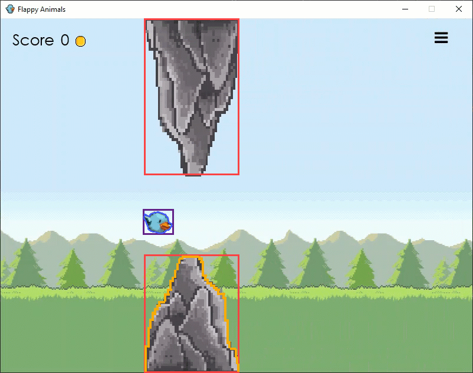

# Flappy Animal - A Game by Bananas

## Spielbeschreibung

### Gameplay
Mit einem Klick auf den Bildschirm kann das Spiel gestartet werden.
Danach beginnen sich die Hindernisse von rechts nach links zu bewegen.
Die Figur kann nun mit der Leertaste bewegt werden. 
Bei jedem Klick der Leertaste springt die Figur nach oben. 
Bei Nichtbetätigung der Leertaste beginnt die Figur zu sinken, bis sie auf dem Boden landet. 
Wird ein Hindernis erfolgreich überwunden, wird ein Punkt gutgeschrieben.
Diese Punkte werden gespeichert und können im Shop verwendet werden, um neue Figuren freizuschalten. 
Sobald der Boden oder ein Hindernis berührt wird, ist das Spiel verloren und die Menüübersicht mit der Aufschrift "Game Over" wird geladen. 
Zudem kann das Menü während des Spiels über die Betätigung Hamburger-Knopfes oben rechts besucht werden.
Die Menü-Ansicht ist abhängig vom Spielstatus.
Die folgenden Möglichkeiten werden im Menü nach Ende des Spiels ("Game Over") bzw. während des Spiels angeboten. 

"Game Over":

- Close
- Restart
- Shop
- Leaderboard

Während des Spiels:

- Close
- Resume
- Restart
- Leaderboard

Sofern "Close" angeklickt wird, schliesst sich das Spiel. 
Falls "Restart" geklickt wird, wird das Spiel neugestartet. 
Mit dem "Resume"-Knopf wird das Spiel, nach Betätigen des Hamburger-Menü-Symbol fortgesetzt. Über den Leaderboard-Knopf können die Highscores angezeigt werden.


### Shop


Der Shop ist dazu da, um sich neue Figuren zu kaufen oder bereits gekaufte zu selektieren. 
Hier werden alle Figuren aufgelistet. 
Jede Figur kann mit einer gewissen Anzahl der Punkte frei gekauft werden. Sobald man eine neue Figur kauft, werden diese Anzahl Punkte subtrahiert. 
In der Liste werden die Bilder und die Merkmale dieser Figuren aufgelistet. "Gravity" steht für die Fallgeschwindigkeit und "Strength" für die Sprungkraft der Figur.
Im Shop wird ein "Back"-Button und die Anzahl der Punkte angezeigt. 
Beim Betätigen des "Back"-Buttons, wird wiederum das Menü geladen.

### Leaderboard


Im Leaderboard werden die drei besten Scores angezeigt. 
Sobald ein besserer Punktestand erzielt wurde, kann dieser im Leaderboard auf der Schriftrolle mit einem Namen versehen werden. 
Über die "Enter"-Taste wird der Name, sowie der weiter unten in der Schriftrolle stehende aktuelle Punktestand gespeichert.
Oben links befindet sich ein "Back"-Button. Wird dieser angeklickt, wird das Leaderboard verlassen und das Menü stattdessen angezeigt. 


## Project Management
### Developers

- Sandro Guerotto (guerosan)
- Landrit Ahmeti (ahmetlan)
- David Gerber (gerbeda3)
- Safiyya Waldburger (waldbsaf)


### Branching Modell

Aus der Entwicklung der Architektur für das Projekt entstanden folgende langlebige Branches:

- Master: ist der Hauptbranch, erhält lauffähiger Code aus dem Developmentbranch. HotFixes werden als Ausnahme auf dem Master durchgeführt.

- Development: hier werden laufend die neuen Codefragmente aus den Branches Core, Menu und Shop zusammengeführt.

- Feature-Branches: drei langlebige Branches (Core, Menu, Shop), welche aus der Architektur des Projekts entwickelt wurden.

- Unstable: beinhaltet Code, welcher nicht lauffähig bzw. fehlerbehaftet ist. Der Zweck dieses Branches ist der Austausch zum Code unter den Mitgliedern.

- Documentation: auf diesem Branch wird die Dokumentation des Spiels geführt.

#### Pull requests

Voraussetzungen für einen Pull requests:
- Issue wurde so weit wie möglich umgesetzt 
- Code ist kompilierbar
- Clean Code Regeln wurden eingehalten

Die Pull requests werden von mindestens einem weiteren Projektmitglied (in der Regel erfahrenem) überprüft bzw. gutgeheissen.
Pull requests finden überwiegend während unseren Teamsitzungen statt, in welchen zudem Rückmeldungen zum Code oder weitere projektrelevante Themen besprochen werden.

##### Beispiele für Pull requests

[Pull Request Nr. 30 Merge all core the development](https://github.zhaw.ch/PM2-IT20taZH-bles-mach-zubj/hk2-gruppe-02-bananas-projekt2-flappyanimals/pull/30) <br>
[Pull Request Nr. 32 Menu](https://github.zhaw.ch/PM2-IT20taZH-bles-mach-zubj/hk2-gruppe-02-bananas-projekt2-flappyanimals/pull/32)


#### Issues

Die Verwaltung des Projekts findet über GitHub mittels Issues statt.
Für die Issues werden dem Branching-Modell entsprechende Labels (core, menu, shop, bug, documentation) verwendet. 
Die Labels werden entsprechend dem Architekturaufbau des Spiels verwendet.
Issues, die während der Entwicklung durch verursachte oder neu entdeckte Fehler entstehen, erhalten das Label "bug".

##### Beispiele für Issues

[Issue Nr. 11 Shop: List mit Items](https://github.zhaw.ch/PM2-IT20taZH-bles-mach-zubj/hk2-gruppe-02-bananas-projekt2-flappyanimals/issues/11) <br>
[Issue Nr. 22 Custom Hitbox](https://github.zhaw.ch/PM2-IT20taZH-bles-mach-zubj/hk2-gruppe-02-bananas-projekt2-flappyanimals/issues/22)

## Architektur
#### MVC-Pattern 
Das Projekt wurde in die Module Core (Gamelogik und Model), Shop (Shoplogik), Menu (Menulogik und Leaderboard) unterteilt.
Ein möglichst geringer Grad der Abhängigkeiten zwischen den Komponenten wurde angestrebt.
Im Grunde wird für den Spielablauf nur das Modul core benötigt. 
Die Module Shop und Menu sind somit ohne grossen Aufwand ersetzbar. 
Das MVC-Pattern wurde vollumfänglich umgesetzt. Nur die Controller greifen auf die View zu und nehmen Änderungen vor
Die Spiellogik und Shoplogik ist komplett losgelöst vom GUI bis auf die vom Spielkontext gegebenen Komponenten, wie beispielsweise der Boden oder die Spielfläche.
Eine Pausierung des Spiels oder der Wechsel in den Shop geschehen direkt über den betreffenden Controller.

#### Datenspeicherung über JSON
Das Game und der Shop erhalten zudem die Spieldaten von "aussen" und lesen und schreiben diese nicht selber.
Dies begünstigt eine Erweiterung bzw. Weiterentwicklung der Inputdaten beispielsweise mit einer Datenbank.
Folglich kann die Beschaffung bzw. Speicherung der Spieldaten (Spieler, Character) und das GUI komplett ersetzt werden.
Die Inputdaten für das Spiel erfolgen mithilfe von JSON-Dateien. 
Weitere Charaktere können wie folgt über einen Eintrag in der JSON-Datei `resources/characters.json` hinzufügt werden:
```javascript
 {
    "gravity": 3, //int 
    "strength": 70, //int
    "costs": 5, //int
    "id": 13, //unique identifier as int
    "name": "yourName", //"String"
    "imagePath": "Path/image.png" //Path to image
  }
```

#### Timeline
Das automatische Generieren von Hindernissen (ObstacleSpawner), wie auch der Tick (GameEngine), laufen asynchron und wurden mit einer JavaFX-Timeline umgesetzt.
Dies hat den Vorteil, dass die JavaFX-Komponente direkt modifiziert werden können (x,y Koordinaten), da die Timelines über den JavaFX-Application-Thread verwaltet werden.
Ein Beispiel dafür ist die Bewegung eines Hindernisses von rechts nach links, eine sogenannte "Animation" (KeyFrames), welche nach einer bestimmten Zeitspanne ausgeführt wird. 

#### Kollisionsprüfung 
Die Kollisionsprüfung findet jeden "Tick" (alle 20 Millisekunden) statt.
Zuerst wird geprüft, ob das Charaktermodel die Decke (Y <= 0) oder den Boden berührt. Die beiden Prüfungen werden über den Vergleich der Y-Koordinaten gemacht.
Nachdem beide Prüfungen erfolgreich waren (keine Kollision) werden die Hindernisse geprüft.

Die erste Abfrage für ein Hindernis geschieht über die Boundaries. 
Siehe Rechtecke rot bzw. lila in folgender Abbildung:



Falls das Charaktermodel und das Hindernis sich überschneiden, werden die Hitboxen (siehe ebenfalls obige Abbildung orange resp. blau Umrandungen) verglichen. 
Diese erste Prüfung ist notwendig, da die nachfolgende Prüfung äusserst rechenintensiv ist und das Spiel sonst nicht flüssig laufen würde.
Die Polygone werden mit `Shape.intersects(Shape, Shape)` verglichen. 
Diese Methode erstellt die Schnittfigur von den zwei gegebenen Shapes.
Hat diese neue Figur eine Breite oder Höhe, welche nicht -1 entspricht, dann gibt es eine Kollision und das Spiel ist vorbei.

Das Bauen der Hitbox erfolgt über die Klasse `HitboxBuilder`. 
Diese Klasse liest ein Bild ein und verarbeitet die Pixel.
Jede Zeile wird verarbeitet und wenn nötig als Punkt für das Polygon abgespeichert.
Da die Bilder vier Farbkanäle (ARGB) haben, wird nur jede vierte Information geprüft (Alphakanal). 
Falls dieses Pixel nicht transparent ist, wird dieser Punkt als gespeichert als XY-Koordinate. 
Danach wird erst wieder ein Punkt gespeichert, wenn ein erneutes transparentes Pixel kommt oder es das Ende der Zeile ist.
Am Ende ergeben die Punkte eine "Outline" (Umriss) der nicht transparenten Pixel.
Wenn eine Hitbox nicht generiert werden kann, wird als Fallback-Lösung ein einfaches Rechteck als Umrisslinie gezogen.

#### Weitere Bemerkungen:
- In diversen Klassen wurde anstelle eines Konstruktors eine `create` Methode verwendet. 
  Infolgedessen konnten komplexe Logiken und Abhängigkeiten für das Testing aufgelöst werden. 
  Durch ein `MockedStatic` Objekt konnte die Generierung von konkreten Objekten gefälscht werden. 
  Die folgende Codezeile in der Klasse GameTest (Zeile 57) zeigt ein Beispiel für ein gefälschtes Objekt: ` obstacleFactoryMock.when(() -> ObstacleSpawner.create(any(), any())).thenReturn(spawnerMock);`
  
- Einige Methoden, die nur in einer Timeline aufgerufen werden, wurden explizit öffentlich gemacht, um diese für weitere Entwicklungen zugänglich zu machen.
  Zudem ermöglicht es, die betreffenden Methoden vollständig zu testen.

#### Klassendiagramm


## Tests

#### GameEngineTest:
Ob die Timeline auch wirklich die Methoden aufruft, konnte nicht getestet werden,
da dafür ein JavaFX-Application-Thread nötig wäre.
Da nicht jede x/y-Koordinate getestet werden kann, wurde pro Methode ein Szenario gewählt, welches dementsprechend für alle Punkte gilt.

| Test | Expected | Received | Result |
|:--------------|:----------------|:--------------|--------------:|
| testTick | Charakter und Hindernisse werden bewegt, <br>Kollision und Überwindung werden geprüft, Spiel wird nicht beendet | Charaktere und Hindernisse wurden bewegt, Kollision und Überwindung sind erfolgt | passed |
| testCollisionCeiling | Kollision mit der Decke wird entdeckt, führt zum Beenden des Spiels | Spiel wurde beendet | passed |
| testCollisionFloor | Kollision mit dem Boden wird entdeckt, führt zum Beenden des Spiels | Spiel wurde beendet | passed |
| testCollisionNearMiss | Kollision mit einem Hindernis (nur Pre-Check) wird entdeckt, genaue Prüfung mittels Hitbox erweist sich als negativ | Prüfung mittels Hitbox negativ | passed |
| testCollisionHit | Kollision mit einem Hindernis wird entdeckt, genaue Prüfung mittels Hitbox erweist sich als positiv, Spiel wird beendet | Spiel wurde beendet | passed |
| testPassedObstacle | Spieler erhält einen Punkt, Spiel läuft | Spieler erhielt einen Punkt | passed |
| testMissedObstacle | Hindernis wird nicht passiert, Spieler erhält keinen Punkt, Spiel läuft | Spieler erhielt keinen Punkt | passed |

#### GameTest:
| Test | Expected | Received | Result |
|:--------------|:---------------|:--------------|--------------:|
| testInitializeGame | Hitbox vom aktuellen Character wird generiert, ObstacleSpawner und GameEngine werden erstellt, Zustand des Games: INITIALIZED | HitBox wurde generiert, ObstacleSpawner und GameEngine wurden erstellt, Zustand des Games: INITIALIZED  | passed |
| testJumpRunning | Sprung wird ausgeführt | Sprung wurde ausgeführt | passed |
| testJumpPaused | IllegalStateException geworfen | IllegalStateException wird geworfen, Jump wurde nicht ausgeführt | passed |
| testGetPlayer | Aktuelle Spielerdaten | Aktuelle Spielerdaten wurden geliefert | passed |
| testPauseValid | ObstacleSpawner, GameEngine sind pausiert,  Zustand des Games: PAUSED| ObstacleSpawner und GameEngine wurden pausiert, Zustand des Games: PAUSED| passed |
| testPauseInvalid | IllegalStateException geworfen | IllegalStateException wurde geworfen, Zustand des Games: FINISHED | passed |
| testRunGameValid | ObstacleSpawner, GameEngine sind gestartet, Zustand des Games: RUNNING | Zustand des Games: RUNNING | passed |
| testRunGameInvalid | ObstacleSpawner, GameEngine nicht gestartet, IllegalStateException wird geworfen | ObstacleSpawner und GameEngine wurde nicht gestartet, IllegalStateException wurde geworfen  | passed |
| testRegisterFloor | Floor wird übergeben | Floor wurde gesetzt | passed |
| testGameOver | Balance wird auf 1000 erhöht, ObstacleSpawner, GameEngine sind gestoppt,  Zustand des Games: FINISHED | Balance wurde auf 1000, ObstacleSpawner und GameEngine wurden gestoppt, Zustand des Games: FINISHED | passed |
| testRestart | Alle Hindernisse (Obstacles) werden gelöscht, Spiel wird initialisiert | Spielzustand: RUNNING, alle Obstacles wurden zerstört | passed |

#### HitboxBuilderTest:
Für die Polygongenerierung wurde ein 3x4 grosses Bild verwendet, um den Aufwand für das Testing zu minimieren. Die ersten beiden Tests mit dem Rechteckt und Kreuz implizieren, dass die Generierung auch für andere Bildgrössen funktionieren würde.  

| Test | Expected | Received | Result |
|:--------------|:--------------|:--------------|--------------:|
| testBuildHitboxSimple | Einfaches Rechteck wird erstellt | 12 Punkte (jeweils x und y Punkte), entsprechende Polygonpunkte wurden erstellt | passed |
| testBuildHitboxComplex | Ein Kreuz wird erstellt | 12 Punkte (jeweils x und y Punkte), entsprechende Polygonpunkte wurden erstellt | passed |
| testBuildRectangle | Ein Rechteck in gegebener Breite und Höhe wird erstellt | Polygon in Form eines Rechtecks wurde erstellt | passed |

#### JSONWriterReaderTest:
ACHTUNG: Hier muss vorher sichergestellt werden, dass der test resources Ordner vorhanden ist.

| Test | Expected | Received | Result |
|:--------------|:---------------|:--------------|--------------:|
| writePlayerData | Ein Punkt wird zur Balance des Players gutgeschrieben, balance = 11 | Balance wurde dem JSON-File übertragen | passed |
| readPlayerData | Testdaten werden gelesen,  balance = 11 und currentScore = 0 | Testdaten (inkl. balance und currentScore) wurden dem Objekt "Player" zugewiesen | passed |
| writeCharactersData | 2 Testcharaktere werden ins JSON-File geschrieben | Charaktere wurden ins JSON-File geschrieben  | passed |
| readCharactersData | 2 Testcharaktere werden gelesen | 2 Testcharaktere wurden gelesen | passed |

#### ObstacleSpawnerTest:
Ob die Timeline auch wirklich die Methoden aufruft, konnte nicht getestet werden, da dafür ein JavaFX Application Thread nötig ist.

| Test | Expected | Received | Result |
|:--------------|:--------------|:--------------|--------------:|
| testSpawn | 2 Hindernisse werden erstellt | Hindernisse wurden erstellt | passed |
| testDestroyAll | Alle Hindernisse werden zerstört, Listengrösse beträgt 0 | keine Hindernisse mehr vorhanden, Listengrösse beträgt 0 | passed |
| testDestroyOutOfBound | Hindernis ausserhalb des Fensters wird automatisch zerstört, Listengrösse beträgt 1 | Hindernis ausserhalb des Fensters wurde zerstört, Listengrösse beträgt 1 | passed |

#### ShopTest:
| Test | Expected | Received | Result |
|:--------------|:---------------|:--------------|--------------:|
| testBuyCharacter | Kaufe einen Charakter für 10 Coins mit anfänglich 10 Coins | Charakter wird gekauft, Balance ist 0 | passed |
| testBuyCharacterBalanceToLow | Versuche einen 10 Coins Charakter mit 5 Coins zu kaufen | unlocked Characters ist immer noch 0 | passed |
| testSelectCharacter | Charakter mit der ID 2 auswählen | Charakter mit ID 2 wurde ausgewählt | passed |
| testGetPlayer | Testen ob Spieler geholt werden kann | Spieler kann geholt werden | passed |


#### PlayerTest:
| Test | Expected | Received | Result |
|:--------------|:---------------|:--------------|--------------:|
| testEmptyHighscore | Player "Test" mit Score: 5 soll auf Platz 1  | Player "Test" mit Score: 5 ist auf Platz 1 | passed |
| testPartialHighscore | Player "Test" mit Score: 5, soll auf Platz 2 nach  Player "Existing" mit Score: 8 | Player "Test, Score: 5 ist auf Platz 1 | passed |
| testFullHighscore | Player "Test" mit Score: 9, soll auf Platz 2 nach Player "Existing1" mit Score 10", <br> aber vor Player "Existing3" mit Score: 5 | Highscoreliste ist voll belegt (Listengrösse = MAX_HIGHSCORES), <br> Player "Test" befindet sich nach Player "Existing1" und vor Player "Existing3" | passed |
| testFullHighscoreToLow | Player "Test" mit Score: 4 soll nicht der Liste hinzugefügt werden | Player "Test" erscheint nicht in der Liste | passed |
| testAddBalance | Balance wird auf 500 gesetzt | Balance beträgt 500 | passed |
| testAddBalanceMaximum | Balance wird bei Überschreitung des Maximumwerts, auf Maximum (999'999) gesetzt | Balance ist gleich Maximum | passed |
| testAddPoint | Zu 5 Scorepunkten wird 1 dazugezählt | Score beträgt 6 | passed |


### Grafikverzeichnis:

Background (Game und Leaderboard): *https://hipwallpaper.com/view/E4Lads* [letzter Zugriff: 1.5.2021]

Rock: *https://images.cdn4.stockunlimited.net/illustration/pixelated-boulder_2008650.png* [letzter Zugriff: 1.5.2021]

Bird: *https://nl.pinterest.com/pin/664984701206303062/* [letzter Zugriff: 1.5.2021]

Fox: *https://www.pngitem.com/middle/owhwiw_transparent-cute-fox-png-cute-pixel-art-fox/* [letzter Zugriff: 2.5.2021]

Bear: *https://www.redbubble.com/de/i/poster/8-bit-We-Bare-Bears-von-theoluk/41381682.LVTDI* [letzter Zugriff: 2.5.2021]

Background (Shop): *https://mocah.org/4573821-vladstudio-library-ladders-candles-shelves-books.html* [letzter Zugriff: 4.5.2021]

Pillar: *https://www.pinterest.ch/pin/278449189437865844/* [letzter Zugriff: 7.5.2021]

Medals: *https://media.istockphoto.com/vectors/medal-icon-set-isolated-on-white-competition-awards-flat-style-vector-vector-id1090406078?k=6&m=1090406078&s=612x612&w=0&h=RZLYX0oJRfUBPt6ZvhUnpYU_rhUxANexUsQoTsAbpec=(2)* [letzter Zugriff: 7.5.2021]

Scroll: *http://pixelartmaker.com/art/bb3dc7960467f39* [letzter Zugriff: 8.5.2021]
